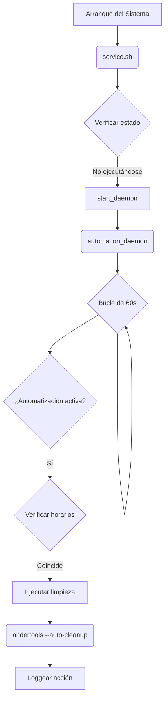

# Documentación Técnica y Guía de Usuario - AnderTools v1.0

## 1. Resumen Ejecutivo del Proyecto

### 1.1 Transformación Risk → AnderTools

AnderTools v1.0 nace de la evolución del popular módulo Magisk "Risk", manteniendo su potente motor de optimización manual y añadiendo una capa de **automatización inteligente**. Este proyecto transforma una herramienta de control manual en un sistema proactivo de gestión de rendimiento para Android, diseñado tanto para usuarios novatos como avanzados.

El objetivo principal ha sido preservar la compatibilidad total con las funcionalidades de Risk, al tiempo que se introduce un sistema de limpieza programable que reduce la necesidad de intervención manual y mantiene el dispositivo optimizado de forma continua.

### 1.2 Funcionalidades Clave

#### 🤖 **NUEVAS CARACTERÍSTICAS DE AUTOMATIZACIÓN**
- **Sistema de Automatización Programable**: Hasta 2 limpiezas automáticas diarias.
- **Configuración de Horarios**: Formato 24h para precisión.
- **3 Tipos de Limpieza Automática**: Segura, Agresiva y Solo RAM.
- **Daemon de Automatización**: Proceso en segundo plano, eficiente y persistente.
- **Interfaz de Configuración Intuitiva**: Menú "A" para gestión completa.

#### 📱 **FUNCIONALIDADES HEREDADAS DE RISK** (100% Compatible)
- Todos los modos de limpieza manual (Segura, Agresiva, Personalizada, etc.).
- Compatibilidad total con el comando `risk`.
- Migración automática de configuraciones de Risk existentes.
- Sistema de exclusiones de aplicaciones preservado.

### 1.3 Beneficios y Mejoras Logradas
- **Optimización Proactiva**: Mantiene el dispositivo en su máximo rendimiento sin intervención manual.
- **Facilidad de Uso**: Configuración de "configurar y olvidar" para usuarios no técnicos.
- **Control granular**: Mantiene todas las opciones manuales para usuarios avanzados.
- **Eficiencia de Batería**: Al reducir procesos en segundo plano, se optimiza el consumo de energía.
- **Logging Avanzado**: Trazabilidad completa de acciones automáticas y manuales.

## 2. Guía Técnica de Implementación

### 2.1 Arquitectura del Sistema de Automatización

La arquitectura de AnderTools se ha diseñado para ser modular y eficiente, separando el motor de optimización de la lógica de automatización.



### 2.2 Componentes Clave

- **`andertools` (Script Principal)**: Contiene la interfaz de usuario, la lógica de limpieza manual y la API para la automatización (`--auto-cleanup`).
- **`automation_daemon` (Daemon)**: Proceso ligero que se ejecuta en segundo plano. Su única responsabilidad es verificar la hora cada minuto y, si coincide con una tarea programada, llamar al script principal para ejecutar la limpieza.
- **`service.sh` (Script de Servicio)**: Se ejecuta en el arranque del sistema para iniciar el `automation_daemon` y asegurar que los permisos y directorios estén correctamente configurados.
- **`install.sh` (Script de Instalación)**: Gestiona la instalación del módulo, la creación de directorios, la configuración de permisos y la migración de datos desde instalaciones de Risk anteriores.

### 2.3 Estructura de Archivos y Configuraciones

La configuración se gestiona a través de archivos de texto simples para maximizar la compatibilidad y facilitar la edición manual si fuera necesario.

**Directorio de Configuración**: `/sdcard/Android/AnderTools/config/`

| Archivo | Propósito |
|---|---|
| `automation_enabled` | Si existe, la automatización está activa. |
| `schedule_1_enabled` | Si existe, el horario 1 está activo. |
| `schedule_1_time` | Contiene la hora de ejecución (ej: `08:00`). |
| `schedule_1_type` | Contiene el tipo de limpieza (`safe`, `aggressive`, `ram_only`). |
| `last_run_schedule_1` | Guarda la fecha de la última ejecución para evitar duplicados. |
| `excluded_apps.txt` | Lista de aplicaciones a ignorar durante la limpieza. |

### 2.4 Proceso de Instalación y Migración
1.  El script `install.sh` se ejecuta durante la instalación en Magisk.
2.  **Migración**: El script verifica la existencia de `/sdcard/Android/Risk`. Si se encuentra, copia `excluded_apps.txt` y `risk.log` al nuevo directorio de AnderTools.
3.  **Creación de Directorios**: Se crea la estructura `/sdcard/Android/AnderTools/config` y `/sdcard/Android/AnderTools/logs`.
4.  **Permisos**: Se asignan permisos de ejecución a los scripts principales.
5.  **Reinicio**: Tras el reinicio, `service.sh` inicia el `automation_daemon` por primera vez.

## 3. Manual de Usuario Detallado

### 3.1 Instrucciones de Instalación

**Requisitos**:
- Dispositivo Android con root (Magisk o KernelSU).
- Magisk Manager instalado.

**Pasos**:
1.  Descargue el archivo `AnderTools-v1.0-080625.zip`.
2.  Abra Magisk Manager.
3.  Vaya a la sección "Módulos".
4.  Presione "Instalar desde almacenamiento" y seleccione el archivo .zip.
5.  La instalación se completará automáticamente.
6.  Reinicie su dispositivo.

### 3.2 Primeros Pasos y Configuración

1.  Abra una aplicación de terminal (se recomienda Termux).
2.  Ejecute los siguientes comandos:
    ```bash
    su
    andertools
    ```
3.  Verá el menú principal de AnderTools. ¡La instalación ha sido un éxito!

### 3.3 Configuración de la Automatización

La principal ventaja de AnderTools es su capacidad de automatización. Siga estos pasos para configurarla:

1.  En el menú principal, seleccione la opción `A` para entrar en el **Menú de Automatización**.
2.  **Activar el Sistema**: Seleccione la opción `1. Activar/Desactivar automatización`. Esto creará el archivo `automation_enabled` que el daemon busca.
3.  **Configurar Horario 1**: 
    - Seleccione la opción `2. Configurar Horario 1`.
    - Se le preguntará si desea activar el horario. Responda `s`.
    - Ingrese la hora en formato 24h (ej: `07:30`).
    - Seleccione el tipo de limpieza (Segura, Agresiva o Solo RAM).
4.  **Configurar Horario 2**: Repita el proceso para el segundo horario si lo desea.
5.  **Verificar Estado**: En cualquier momento, puede usar la opción `4. Ver estado actual` para confirmar su configuración.

¡Eso es todo! El daemon se encargará del resto, ejecutando las limpiezas en los horarios especificados.

### 3.4 Resolución de Problemas Comunes
-   **La automatización no se ejecuta**: 
    1. Verifique que el sistema de automatización esté activado en el menú.
    2. Asegúrese de que los horarios estén habilitados y correctamente configurados.
    3. Revise los logs en `/sdcard/Android/AnderTools/logs/automation.log` para ver si hay mensajes de error.
-   **Una aplicación importante se cierra**: 
    1. Abra el archivo `/sdcard/Android/AnderTools/config/excluded_apps.txt`.
    2. Añada el nombre del paquete de la aplicación en una nueva línea (ej: `com.mi.aplicacion`).
    3. Guarde el archivo. La aplicación será ignorada en la próxima limpieza.
-   **El comando `andertools` no se encuentra**: 
    1. Asegúrese de haber otorgado permisos de superusuario (`su`) en su terminal.
    2. Si el problema persiste, reinstale el módulo.

### 3.5 Casos de Uso Recomendados
-   **Usuario Promedio**: Active una limpieza "Segura" por la mañana (`08:00`) y una "Solo RAM" por la tarde (`16:00`) para mantener el dispositivo fluido durante el día.
-   **Gamer**: Programe una limpieza "Agresiva" una hora antes de su sesión de juego habitual para liberar la máxima cantidad de RAM.
-   **Ahorro de Batería**: Configure una limpieza "Agresiva" por la noche (`23:00`) para detener todos los procesos no esenciales y minimizar el consumo de batería durante la noche.

## 4. Especificaciones Técnicas

-   **Requisitos del Sistema**: Android 8.0+, Root (Magisk/KernelSU).
-   **Compatibilidad**: Universal para arquitecturas ARM/ARM64. Funciona en la mayoría de las ROMs basadas en AOSP.
-   **Estructura de Logs**: 
    - `automation.log`: Registro principal de acciones automáticas y manuales.
    - `service.log`: Registro de eventos del servicio de arranque.
-   **API Interna**: El script `andertools` acepta el argumento `--auto-cleanup [tipo] [id]` para ser llamado por el daemon, permitiendo la extensibilidad.
-   **Proceso de Soporte**: Para problemas o sugerencias, se recomienda abrir un issue en el repositorio oficial del proyecto (si estuviera disponible) o contactar al desarrollador a través de los canales proporcionados en el módulo.
